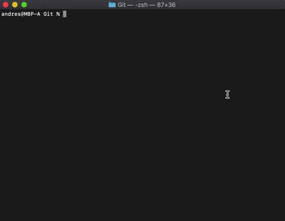

# Root shell exploit for the router Xiaomi 4A Gigabit Global Edition, firmware version 2.28.132

## How to run

```
# Install requirements
# pip3 install -r requirements.txt
# Run the script
# python3 remote_command_execution_vulnerability.py
```

## Demo

