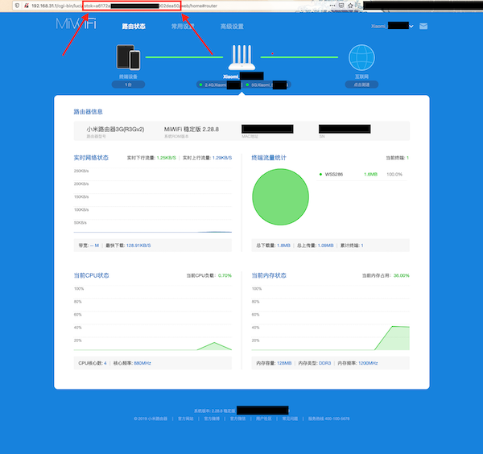

# Root shell exploit for several Xiaomi routers: 4A Gigabit, 4A 100M, 4C, 3Gv2, 4Q, miWifi 3C...

## How to run

**NOTE: FROM VERSION `0.0.2` THE ROUTER NEEDS INTERNET ACCESS**. If you require to run the exploit without internet access please try version `0.0.1`. Find the versions here: https://github.com/acecilia/OpenWRTInvasion/releases

```shell
pip3 install -r requirements.txt # Install requirements
python3 remote_command_execution_vulnerability.py # Run the script
```

You will be asked for the router IP address and for the `stok`. You can grab the `stok` from the router URL after you log in to the admin interface:



After that, a telnet server will be up and running on the router. You can connect to it by running:

```
telnet <router_ip_address>
```

* User: `root`
* Password: `root`

The script also starts an ftp server at port 21, so you can get access to the filesystem using a GUI (for example [cyberduck](https://cyberduck.io)).

## Supported routers and firmware versions

* MiRouter 4A Gigabit: user [ksc91u](https://forum.openwrt.org/u/ksc91u) claims that this method also works on firmware version `2.28.62` and  `2.28.132`: [OpenWrt forum](https://forum.openwrt.org/t/xiaomi-mi-router-4a-gigabit-edition-r4ag-r4a-gigabit-fully-supported-but-requires-overwriting-spi-flash-with-programmer/36685/359). It is also working on the latest `3.0.24` firmware: [OpenWrt forum](https://forum.openwrt.org/t/xiaomi-mi-router-4a-gigabit-edition-r4ag-r4a-gigabit-fully-supported-and-flashable-with-openwrtinvasion/36685/1135).
* MiRouter 4A 100M (non gigabit): user [morhimi](https://forum.openwrt.org/u/morhimi) claims that this method works on firmware version `2.18.51`: [OpenWrt forum](https://forum.openwrt.org/t/xiaomi-mi-router-4a-gigabit-edition-r4ag-r4a-gigabit-fully-supported-but-requires-overwriting-spi-flash-with-programmer/36685/372). User [Jeffpeng](https://forum.openwrt.org/u/jeffpeng) claims that this method works on firmware version `2.18.58`: [OpenWrt forum](https://forum.openwrt.org/t/xiaomi-mi-router-4a-gigabit-edition-r4ag-r4a-gigabit-fully-supported-but-requires-overwriting-spi-flash-with-programmer/36685/373).
* MiRouter 4C: user [Jeffpeng](https://forum.openwrt.org/u/jeffpeng) claims that this method works on firmware version `2.14.81`: [OpenWrt forum](https://forum.openwrt.org/t/support-for-xiaomi-mi-router-4c-r4cm/36418/31).
* Mi Router 3Gv2: user [Massimiliano Mangoni](massimiliano.mangoni@gmail.com) claims that this method also works on firmware version `2.28.8` (message posted in Slack).
* Mi Router 4Q (aka R4C): user cadaverous claims that this method also works on firmware version `2.28.48` (message posted in Slack), but because the router is mips architecture (not mipsel), he needed to use version `0.0.1` of the script (the other versions use a busybox binary built for the mipsel architecture that is used to start a telnet sever).
* MiWifi 3C: works on firmware versions `2.9.217`, `2.14.45` and `2.8.51_INT`: [OpenWrt forum](https://forum.openwrt.org/t/support-for-xiaomi-miwifi-3c/11643/23), [OpenWrt forum](https://forum.openwrt.org/t/support-for-xiaomi-miwifi-3c/11643/17).
* [Mi Router 4](https://www.mi.com/miwifi4): user [Firef0x](https://github.com/acecilia/OpenWRTInvasion/issues/21#issuecomment-748619870) claims that exploit version `0.0.1` works on firmware version `2.26.175`.
* Xiaomi Mi R3P: user [lukasz1992](https://github.com/acecilia/OpenWRTInvasion/issues/58) claims that the exploit works with the Xiaomi Dev firmware.

## Not supported
* [AC2350 AIOT](https://github.com/acecilia/OpenWRTInvasion/issues/46)

## Xiaomi 4A Gigabit Global Edition

### Firmwares

This repository contains the following firmwares:

* Official Xiaomi - `2.28.62` - in Chinese. SHA256: `a3db7f937d279cf38c2a3bec09772d65`
  * URL in this repository: https://github.com/acecilia/OpenWRTInvasion/raw/master/firmwares/stock/miwifi_r4a_firmware_72d65_2.28.62.bin
* Official Xiaomi - `3.0.24` - in English. MD5: `9c4a60addaad76dc13b6df6b4ac03233`
  * URL in this repository: https://github.com/acecilia/OpenWRTInvasion/raw/master/firmwares/stock/miwifi_r4a_all_03233_3.0.24_INT.bin
  * URL in the official Xiaomi site: http://cdn.awsde0-fusion.fds.api.mi-img.com/xiaoqiang/rom/r4a/miwifi_r4a_all_03233_3.0.24_INT.bin

If you have a pending update in your Xiaomi stock firmware, you can check its md5 hash and the download url by navigating to:

```
http://192.168.31.1/cgi-bin/luci/;stok=<stok>/api/xqsystem/check_rom_update
```

### Install OpenWrt

When installing OpenWrt on the Xiaomi 4A Gigabit, there are several options. **Note that there isn't a stable release for it yet, which means that the firmware may be unstable**:

* The latest snapshot from OpenWrt: `https://downloads.openwrt.org/snapshots/targets/ramips/mt7621/openwrt-ramips-mt7621-xiaomi_mir3g-v2-squashfs-sysupgrade.bin`

* Use a prebuilt image I created myself on `06-06-2020` using `imagebuilder`. The image is hosted in this repository:
  * Link: `https://raw.githubusercontent.com/acecilia/OpenWRTInvasion/master/firmwares/OpenWrt/06-06-2020/openwrt-ramips-mt7621-xiaomi_mir3g-v2-squashfs-sysupgrade.bin`
  * sha: `83feed9ff633863acb1f14b61c30029b924fec252c1ed1e4de2a909e52b2d872 `

* Build your own image with `imagebuilder`, using the latest source code on `master`:

  ```
  docker pull openwrtorg/imagebuilder:ramips-mt7621-master
  docker run --rm -v "$(pwd)"/bin/:/home/build/openwrt/bin -it openwrtorg/imagebuilder:ramips-mt7621-master
  make PROFILE=xiaomi_mir3g-v2 image
  ```

* Other images provided by OpenWrt users (at your own risk): [OpenWrt forum](https://forum.openwrt.org/t/xiaomi-mi-router-4a-gigabit-edition-r4ag-r4a-gigabit-fully-supported-and-flashable-with-openwrtinvasion)

* Wait until there is a stable release of OpenWrt

If **after reading above text** you still want to proceed, after login to the router through telnet run the following commands:

```shell
cd /tmp
curl https://raw.githubusercontent.com/acecilia/OpenWRTInvasion/master/firmwares/OpenWrt/06-06-2020/openwrt-ramips-mt7621-xiaomi_mir3g-v2-squashfs-sysupgrade.bin --output firmware.bin # Put here the URL you want to use to download the firmware
./busybox sha256sum firmware.bin # Verify the firmware checksum before flashing, very important to avoid bricking your device!
mtd -e OS1 -r write firmware.bin OS1 # Install OpenWrt
```

This will install the snapshot version of OpenWrt (without Luci). You can now use ssh to connect to the router (and install Luci if you prefer it).

### Performance:

Some users have reported worse WIFI performance in OpenWrt than in the stock firmware. See the following links:

* [OpenWrt forum](https://forum.openwrt.org/t/xiaomi-mi-router-4a-gigabit-edition-r4ag-r4a-gigabit-fully-supported-but-requires-overwriting-spi-flash-with-programmer/36685/430)
* [OpenWrt forum](https://forum.openwrt.org/t/xiaomi-mi-router-4a-gigabit-edition-r4ag-r4a-gigabit-fully-supported-but-requires-overwriting-spi-flash-with-programmer/36685/431)
* [OpenWrt forum](https://forum.openwrt.org/t/xiaomi-mi-router-4a-gigabit-edition-r4ag-r4a-gigabit-fully-supported-but-requires-overwriting-spi-flash-with-programmer/36685/451)

## For more info and support go to:

* [OpenWrt forum thread](https://forum.openwrt.org/t/xiaomi-mi-router-4a-gigabit-edition-r4ag-r4a-gigabit-fully-supported-but-requires-overwriting-spi-flash-with-programmer/36685)
* [Slack workspace](https://join.slack.com/t/openwrt-workspace/shared_invite/zt-cz2m5uf4-Q8wbP_LKggOy9B7IQyaqfA)

## If you brick your device

You can find solutions in the following links:

* User [albertcp](https://forum.openwrt.org/u/albertcp) posted a very detailed guide: [OpenWrt forum](https://forum.openwrt.org/t/xiaomi-mi-router-4a-gigabit-edition-r4ag-r4a-gigabit-fully-supported-but-requires-overwriting-spi-flash-with-programmer/36685/402)
* User [micky0867](https://forum.openwrt.org/u/micky0867) has some more comments about the topic: [OpenWrt forum](https://forum.openwrt.org/t/xiaomi-mi-router-4a-gigabit-edition-r4ag-r4a-gigabit-fully-supported-but-requires-overwriting-spi-flash-with-programmer/36685/391)
* User [hoddy](https://forum.openwrt.org/u/hoddy) created a [video tutorial](https://www.youtube.com/watch?v=VxzEvdDWU_s)

## Acknowledgments

* Original vulnerabilities and exploit: [UltramanGaia](https://github.com/UltramanGaia/Xiaomi_Mi_WiFi_R3G_Vulnerability_POC)
* Instructions to install OpenWrt after exploit execution: [rogerpueyo](https://forum.openwrt.org/t/xiaomi-mi-router-4a-gigabit-edition-r4ag-r4a-gigabit-fully-supported-but-requires-overwriting-spi-flash-with-programmer/36685/21)
* Testing and detailed install instructions: [hey07](https://forum.openwrt.org/t/xiaomi-mi-router-4a-gigabit-edition-r4ag-r4a-gigabit-fully-supported-but-requires-overwriting-spi-flash-with-programmer/36685/349)
* Checking the URL of pending updates: [sicklesareterrible](https://forum.openwrt.org/t/xiaomi-mi-router-4a-gigabit-edition-r4ag-r4a-gigabit-fully-supported-and-flashable-with-openwrtinvasion/36685/1114?u=acecilia)

## Demo

### Version 0.0.2 and higher: telnet


### Version 0.0.1: netcat (legacy)


